# Experience Topology Report: Cannabis Chemistry Calculator UI/UX Touchpoint Topology

Overall status: **FAIL**

## Coverage Summary

- Nodes: 21
- Edges: 29
- UI: 16
- UX: 1
- DX: 3
- AGENT: 1

## Topology Map

```mermaid
flowchart LR
  title["Cannabis Chemistry Calculator UI/UX Touchpoint Topology"]
  ui_loading_overlay["Launch Loading Overlay (ui)"]
  agent_startup_heuristic["Startup Routing Heuristic (agent)"]
  ui_startup_chooser["Startup Intent Chooser (ui)"]
  ui_first_timer_guide["First-Timer Guide Modal (ui)"]
  ui_nav_shell["Top Navigation Shell (ui)"]
  ux_guided_batch["Guided Batch Journey (ux)"]
  ui_quick_batch["Quick Batch Wizard (ui)"]
  ui_workflow_deck["Decarb Infusion Dose Swipe Deck (ui)"]
  ui_decarb["Decarb Calculator (ui)"]
  ui_infusion["Infusion Calculator (ui)"]
  ui_dose["Dose Calculator (ui)"]
  ui_methods["Methods Comparison (ui)"]
  ui_advanced_tools["Advanced Tools (ui)"]
  ui_journal["Journal (ui)"]
  ui_dashboard["Dashboard (ui)"]
  ui_knowledge["Knowledge (ui)"]
  ui_actions_export_copy["Copy and Export Actions (ui)"]
  ui_timer["Timer Widget (ui)"]
  dx_store_contract["Zustand Store Contract (dx)"]
  dx_ipc_contract["Electron IPC Bridge Contract (dx)"]
  dx_test_contract["Regression Test Coverage (dx)"]
  ui_loading_overlay -->|"App launch triggers startup routing evaluation"| agent_startup_heuristic
  agent_startup_heuristic -->|"Low or medium confidence opens chooser"| ui_startup_chooser
  agent_startup_heuristic -->|"High confidence routes directly to destination tab"| ui_nav_shell
  ui_nav_shell -->|"First-Timer Guide button or first-run state opens modal"| ui_first_timer_guide
  ui_startup_chooser -->|"Make a batch intent"| ui_quick_batch
  ui_startup_chooser -->|"History / learn intent"| ui_journal
  ui_startup_chooser -->|"Resume or repeat intent"| ui_workflow_deck
  ui_nav_shell -->|"Quick Batch tab click"| ui_quick_batch
  ui_nav_shell -->|"Decarb Infusion Dose tab click"| ui_workflow_deck
  ui_workflow_deck -->|"Workflow deck shows decarb panel"| ui_decarb
  ui_workflow_deck -->|"Workflow deck shows infusion panel"| ui_infusion
  ui_workflow_deck -->|"Workflow deck shows dose panel"| ui_dose
  ui_quick_batch -->|"Wizard stepper moves through material, method, fat, dose, label"| ux_guided_batch
  ux_guided_batch -->|"Save Batch to Journal"| ui_journal
  ui_nav_shell -->|"Methods tab click"| ui_methods
  ui_methods -->|"Use This method applies selected decarb settings"| ui_decarb
  ui_nav_shell -->|"Advanced Tools tab click"| ui_advanced_tools
  ui_advanced_tools -->|"Concentrates Use This applies concentrate data"| ui_decarb
  ui_advanced_tools -->|"Fat Comparison Use This applies fat"| ui_infusion
  ui_nav_shell -->|"Dashboard tab click"| ui_dashboard
  ui_nav_shell -->|"Knowledge tab click"| ui_knowledge
  ui_knowledge -->|"Apply to Decarb"| ui_decarb
  ui_decarb -->|"Start method timer"| ui_timer
  ui_journal -->|"Load save delete journal entries"| dx_ipc_contract
  ui_actions_export_copy -->|"Copy or export active report"| dx_ipc_contract
  ui_nav_shell -->|"Tab surfaces expose copy and export actions"| ui_actions_export_copy
  ui_nav_shell -->|"All visible tab changes and calculator edits update store"| dx_store_contract
  dx_store_contract -->|"Store and UI contracts are covered by focused tests"| dx_test_contract
  dx_ipc_contract -->|"IPC-facing helpers validated through export tests"| dx_test_contract
```



## Verification Results

| Check | Status | Detail |
|---|---|---|
| Layer Presence | PASS | All layers present. |
| Edge Reference Integrity | PASS | All edges reference known nodes. |
| Node Connectivity | PASS | No isolated nodes. |
| Data Contract Completeness | PASS | All edges define data contracts. |
| Node Evidence Completeness | PASS | All nodes include evidence. |
| Node Evidence Typing | PASS | All nodes use evidence_type in {test, telemetry, artifact}. |
| Critical Node Executable Evidence | FAIL | Critical nodes require evidence_type in {test, telemetry}. Violations: ui_first_timer_guide (evidence_type=artifact), ux_guided_batch (evidence_type=artifact), ui_quick_batch (evidence_type=artifact), ui_decarb (evidence_type=artifact), ui_infusion (evidence_type=artifact), ui_dose (evidence_type=artifact), ui_journal (evidence_type=artifact), dx_store_contract (evidence_type=artifact), dx_ipc_contract (evidence_type=artifact) |
| High Risk Handoffs | WARN | High risk edges: ui_loading_overlay->agent_startup_heuristic, ux_guided_batch->ui_journal, ui_journal->dx_ipc_contract |
| High-Risk Critical Human Override | PASS | All critical/high-risk edges define human_override=true. |
| Critical Edge Failure Ownership | PASS | All critical-impact edges define fallback_path and owner_on_failure. |
| AI Handoff Contract Completeness | PASS | All declared AI handoffs include planner_output_contract, execution_guard_result, and verification_result. |
| Critical Edge Resilience Controls | PASS | All critical-impact edges define retry_policy, rollback_strategy, and degraded_mode. |

## Risk Register

- FAIL: Critical Node Executable Evidence -> Critical nodes require evidence_type in {test, telemetry}. Violations: ui_first_timer_guide (evidence_type=artifact), ux_guided_batch (evidence_type=artifact), ui_quick_batch (evidence_type=artifact), ui_decarb (evidence_type=artifact), ui_infusion (evidence_type=artifact), ui_dose (evidence_type=artifact), ui_journal (evidence_type=artifact), dx_store_contract (evidence_type=artifact), dx_ipc_contract (evidence_type=artifact)
- WARN: High Risk Handoffs -> High risk edges: ui_loading_overlay->agent_startup_heuristic, ux_guided_batch->ui_journal, ui_journal->dx_ipc_contract

## Suggested Actions

- For each listed critical node, set `evidence_type` to `test` or `telemetry` and ensure it is executable in CI/ops.
- Track follow-up for `High Risk Handoffs` before production.

## Audit Scope And Evidence

This report maps the Cannabis Chemistry Calculator Electron renderer UI/UX from the current source tree at `C:\Users\LEWIS\ccc\cannabis_chemistry_calculator`.

Evidence used:

- Source-traced shell, startup, tab, state, and IPC contracts.
- Prior repo memory for the Advanced Tools integration and launch-flow decisions.
- Topology verifier run against `docs/ui-ux-touchpoint-topology-2026-06-18.json`.
- Focused verification command: `pnpm test -- src/renderer/src/components/__tests__/StartupRouting.test.tsx src/renderer/src/components/__tests__/AdvancedToolsIntegration.test.tsx src/renderer/src/components/__tests__/AdvancedToolsExport.test.ts src/renderer/src/components/__tests__/SwipeDeck.test.ts`.
- Type check command: `pnpm typecheck`.

Runtime limitation:

- The requested `@electron` computer-use tool was not available as a callable tool in this session. Findings below are therefore source-backed and test-backed, with runtime UI claims limited to what the tests mount and assert.

## Actual User Flow

1. App opens into the renderer shell.
2. The loading overlay appears first with the CCC mark and "Loading calculations...".
3. Behind the overlay, startup routing evaluates current persisted state.
4. If this is first run, the shell routes underneath to `Quick Batch` and opens `First-Timer Guide`.
5. If this is a returning ambiguous run, the shell opens `StartupChooser` with `Make a batch`, `Resume or repeat`, and `History / learn`.
6. If the heuristic has high confidence, the shell routes directly to the last successful path.
7. The top nav remains the global escape hatch: `Dashboard`, `Quick Batch`, `Decarb`, `Infusion`, `Dose`, `Methods`, `Advanced Tools`, `Knowledge`, `Journal`, plus `Choose Start` and `First-Timer Guide`.
8. Workflow tabs `Decarb`, `Infusion`, and `Dose` mount inside `SwipeDeck`, so users can move through them by direct tab click, keyboard arrows, wheel/trackpad, edge hover, or touch swipe.
9. Support tabs mount as standalone panels: `Quick Batch`, `Methods`, `Advanced Tools`, `Knowledge`, `Journal`, and `Dashboard`.
10. Output actions flow through shared actions: copy/export via `TabActions`, save/load/delete via the Electron `window.App` bridge, and persisted app state via Zustand.

## Touchpoint Inventory

| Touchpoint | User Sees / Does | State Or Contract | Evidence | UX Notes |
|---|---|---|---|---|
| Loading overlay | Waits through initial branded loading state | `isLoading`, `isExitingLoad` | `src/renderer/screens/main.tsx` | First visible state is clear but blocks interaction until timeout completes. |
| Startup heuristic | App decides chooser versus direct route | `StartupRoutingContext`, `StartupRoutingDecision` | `src/renderer/src/utils/startupRouting.ts` | Strong model because it uses successful paths, not raw tab clicks. |
| Startup chooser | Picks `Make a batch`, `Resume or repeat`, or `History / learn` | `StartupIntent` | `src/renderer/src/components/StartupChooser.tsx` | Good recovery path via `Keep current view`; should be runtime-tested with real persisted states. |
| First-Timer Guide | Walks a beginner through equipment, prep, decarb, infusion, dose, make | `firstTimerOpen`, `firstRunDismissed` | `src/renderer/src/tabs/FirstTimerGuide.tsx` | High value first-run path, but currently lacks dedicated executable UI coverage. |
| Top nav | Moves between all main surfaces | `TabId`, `activeTab` | `src/renderer/screens/main.tsx` | Clear global escape hatch; grouping is workflow/calculator/reference but labels mix novice and expert concepts. |
| Choose Start | Reopens startup chooser manually | Startup decision recalculation | `src/renderer/screens/main.tsx` | Important because it prevents heuristic lock-in. |
| Quick Batch | Guided five-step batch path | `DecarbState`, `InfusionState`, `DoseState`, `JournalEntry` | `src/renderer/src/tabs/QuickBatchTab.tsx` | Best default path for new or uncertain users; save path is high impact. |
| Start from last batch | Loads latest journal entry into calculator fields | `JournalEntry` to store setters | `src/renderer/src/tabs/QuickBatchTab.tsx` | Strong repeat-user affordance; depends on journal data freshness. |
| Quick Batch stepper | Clicks or next/back through material, method, fat, dose, label | Local `step` plus store slices | `src/renderer/src/tabs/QuickBatchTab.tsx` | Good linear model; should be tested end-to-end because it is a critical path. |
| Save Batch to Journal | Persists generated batch summary | `window.App.saveJournalEntry` | `src/renderer/src/tabs/QuickBatchTab.tsx` | Has local fallback, but IPC success/failure UX deserves runtime testing. |
| Decarb calculator | Enters material, potency, method, overrides, bag details | `DecarbState` | `src/renderer/src/tabs/DecarbTab.tsx` | Powerful but dense; expert-facing, not ideal as startup default. |
| Strain manager | Opens strain management from Decarb | `Strain[]` | `src/renderer/src/components/StrainManager.tsx` | Useful supporting path; not central to startup. |
| Bag calculator | Adjusts bag/grind/stem constraints | `DecarbState` bag fields | `src/renderer/src/components/BagCalculator.tsx` | Good specialist helper; risk is visual density inside Decarb. |
| Decarb timer | Starts method or custom timer | `TimerState` | `src/renderer/src/components/Timer.tsx` | Critical timing helper, but no visible notification/runtime evidence was verified here. |
| Infusion calculator | Enters decarbed THC, fat, volume, custom efficiency | `InfusionState`, `UnitPreferences` | `src/renderer/src/tabs/InfusionTab.tsx` | Logical second workflow stage; receives upstream carry-forward. |
| Dose calculator | Enters total THC, servings, format, reverse mode | `DoseState` | `src/renderer/src/tabs/DoseTab.tsx` | Clear result surface with classification, radar, scale, label generator. |
| Reverse mode | Computes required material from target dose | `DoseState.reverseMode` | `src/renderer/src/tabs/DoseTab.tsx` | Valuable power-user mode; mode switch can change mental model abruptly. |
| Scale batch | Applies factors to recipe state | `scaleRecipe` result | `QuickBatchTab.tsx`, `DoseTab.tsx` | Useful, but repeated across surfaces and should have shared UX consistency checks. |
| Label generator | Builds label content from dose result | `LabelState` | `src/renderer/src/components/LabelGenerator.tsx` | Appears after meaningful dose results; tied to save/report journey. |
| Methods | Compares decarb methods and applies one | `DecarbState.presetId` | `src/renderer/src/tabs/MethodsTab.tsx` | Good optimization path; `Use This` handoff is clear. |
| Advanced Tools | Opens fat comparison, concentrates, blending, cost analysis | `AdvancedToolsState` | `src/renderer/src/tabs/AdvancedToolsTab.tsx` | Reachability has focused tests; now correctly mounted under `Advanced Tools`. |
| Fat Comparison | Compares extraction across fats and applies fat | `InfusionState.fatId` | `AdvancedToolsTab.tsx` | Strong handoff back to Infusion. |
| Concentrates | Calculates concentrate potency and applies Decarb state | `DecarbState.materialMode` | `AdvancedToolsTab.tsx` | Strong handoff back to Decarb. |
| Strain Blending | Adds/removes strains, sets target weight/potency | `AdvancedToolsState.blending` | `AdvancedToolsTab.tsx` | Useful standalone calculator; no direct save/report issue found. |
| Cost Analysis | Calculates method cost and cost per dose | `AdvancedToolsState.cost` | `AdvancedToolsTab.tsx` | Strong business/optimization tool; export coverage exists. |
| Knowledge | Reads explanatory cards and applies curve data to Decarb | `DecarbState overrides` | `src/renderer/src/tabs/KnowledgeTab.tsx` | Reference surface with one actionable handoff. |
| Journal | Loads, logs, saves, searches, filters, deletes entries | `JournalEntry[]`, `window.App` journal methods | `src/renderer/src/tabs/JournalTab.tsx` | Critical history surface; delete is direct and should have confirmation if data loss matters. |
| Dashboard | Reviews summary metrics and inventory-style insights | `InventoryState`, `JournalEntry[]` | `src/renderer/src/tabs/DashboardTab.tsx` | Good overview surface; not currently part of startup chooser. |
| Copy/export actions | Copies text or exports active report payload | `buildTabCopyText`, `buildExportReport`, `window.App` IPC | `TabActions.tsx`, `exportReport.ts` | Coherent for Advanced Tools after recent integration. |
| Presets | Saves/loads full calculator state | `window.App.savePreset`, `window.App.loadPresetDialog` | `src/renderer/src/components/PresetActions.tsx` | Important DX/user persistence touchpoint; not visible in the main shell map unless surfaced by tabs. |
| Store persistence | Persists units, theme, labels, inventory, workflow state, startup routing | Zustand `persist` partialize | `src/renderer/src/stores/appStore.ts` | Strong shared contract; risk is silent stale state if migrations are needed later. |
| IPC bridge | Renderer calls native save/load/export/copy APIs | `window.App` global contract | `src/renderer/src/global.d.ts` | Critical boundary; needs runtime Electron smoke tests beyond renderer tests. |

## Handoff Map

| Handoff | Source | Destination | Risk | Notes |
|---|---|---|---|---|
| Launch to route | Loading overlay | Startup heuristic | High | Wrong decision changes first useful screen. Manual `Choose Start` mitigates. |
| Heuristic to chooser | Startup heuristic | Startup chooser | Medium | Good because user confirms ambiguous cases. |
| Heuristic to direct tab | Startup heuristic | Nav shell active tab | Medium | Guarded to only intercept bootstrap default. |
| First run | Startup routing | Quick Batch plus guide | Medium | Correct human path; guide UI needs executable test coverage. |
| Make a batch | Startup chooser | Quick Batch | Low | Best default path. |
| Resume/repeat | Startup chooser | Workflow deck or Quick Batch | Medium | Depends on persisted draft/success state quality. |
| History/learn | Startup chooser | Journal | Low | Good but does not expose Knowledge/Dashboard as secondary choices. |
| Quick Batch save | Guided batch | Journal/IPC | High | Has local fallback, but data contract is critical. |
| Journal load/save/delete | Journal | IPC bridge | High | Delete path is especially sensitive. |
| Methods Use This | Methods | Decarb | Medium | Clear handoff. |
| Advanced fat Use This | Advanced Tools | Infusion | Medium | Clear handoff. |
| Advanced concentrate Use This | Advanced Tools | Decarb | Medium | Clear handoff. |
| Knowledge Apply | Knowledge | Decarb | Medium | Useful but could surprise if user has unsaved Decarb inputs. |
| Copy/export | Active tab | IPC bridge | Medium | Focused export tests exist; runtime native dialog still needs smoke testing. |
| Store persistence | All tabs | Zustand persisted state | Medium | Powerful but can preserve confusing stale inputs. |

## Key Findings

### P1: Critical UI nodes lack executable UI evidence

The verifier failed because several critical surfaces are currently backed by source artifacts rather than executable UI tests or telemetry: First-Timer Guide, Quick Batch, Decarb, Infusion, Dose, Journal, store contract, and IPC contract.

Impact:

- Source presence is not enough to prove that the human can complete the flow in the mounted app.
- The highest-risk missing proof is the complete path: first run -> guide -> Quick Batch -> save -> Journal -> reopen/repeat.

Recommended acceptance:

- Add renderer integration tests for `FirstTimerGuide`, `QuickBatchTab`, `JournalTab`, and raw calculator shell traversal.
- Add at least one Electron smoke test for IPC-backed save/load/export/copy.

### P1: Journal and IPC are high-risk persistence boundaries

Journal save/load/delete and Quick Batch save cross from renderer state into the Electron bridge. Quick Batch has a local fallback on save, but Journal load/delete rely on `window.App` outcomes.

Impact:

- A failure here can lose user trust because history is the memory of the product.
- Delete appears direct from the mapped code path; if no confirmation exists elsewhere, accidental deletion is a UX risk.

Recommended acceptance:

- Confirm delete behavior in runtime Electron.
- Add a confirmation or undo affordance if delete is currently immediate.
- Add failure-state tests for `saveJournalEntry`, `loadJournalEntries`, and `deleteJournalEntry`.

### P2: Startup routing is now logically strong, but needs real persisted-state scenarios

The startup model is sound: first run gets guide plus Quick Batch, ambiguous return gets chooser, confident return gets last successful path, and nav provides manual override.

Risk:

- The heuristic depends on persisted state quality.
- Stale or migrated state could make `resume_repeat` point to a calculator state that no longer reflects user intent.

Recommended acceptance:

- Add tests for migrated/missing `startupRouting` fields.
- Add a small "why this start" signal or inspectable state in dev builds if startup behavior becomes hard to debug.

### P2: The shell has three mental models at once

The nav exposes guided batch creation, raw calculators, and reference/history surfaces in one strip. The chooser improves the first decision, but after startup the shell still mixes beginner and expert concepts.

Risk:

- New users can leave the guided path and land in dense expert calculators.
- Power users are fine, but novice recovery depends on seeing `Quick Batch`, `Choose Start`, or `First-Timer Guide`.

Recommended acceptance:

- Keep `Quick Batch`, `Choose Start`, and `First-Timer Guide` visually findable.
- Consider future grouping labels such as Make, Optimize, Reference if the nav gets redesigned.

### P3: Advanced Tools is coherent and reachable

The mounted `Advanced Tools` surface exposes Fat Comparison, Concentrates, Strain Blending, and Cost Analysis. Focused tests verify reachability and export/copy behavior.

Remaining risk:

- Runtime visual fit across small widths was not verified in this audit because the Electron computer-use tool was unavailable.

Recommended acceptance:

- Add a viewport smoke test or screenshot check for Advanced Tools sub-nav on narrow widths.

## Recommended Next Work

1. Add executable UI tests for the critical flow: `FirstTimerGuide` -> `QuickBatchTab` -> `Save Batch to Journal` -> `Journal`.
2. Add Electron runtime smoke coverage for `window.App` IPC methods: report export, clipboard copy, journal load/save/delete, preset save/load.
3. Add a delete confirmation or undo path for Journal entries if runtime inspection confirms deletion is immediate.
4. Add persisted-state tests for startup routing with missing/old fields.
5. Add responsive checks for `StartupChooser`, top nav overflow, Advanced Tools sub-tabs, and Quick Batch stepper.

## Verification Run

Commands run:

```powershell
python C:\Users\LEWIS\.codex\skills\experience-topology-verifier\scripts\build_experience_topology.py --input C:\Users\LEWIS\ccc\cannabis_chemistry_calculator\docs\ui-ux-touchpoint-topology-2026-06-18.json --output C:\Users\LEWIS\ccc\cannabis_chemistry_calculator\docs\ui-ux-touchpoint-report-2026-06-18.md
pnpm test -- src/renderer/src/components/__tests__/StartupRouting.test.tsx src/renderer/src/components/__tests__/AdvancedToolsIntegration.test.tsx src/renderer/src/components/__tests__/AdvancedToolsExport.test.ts src/renderer/src/components/__tests__/SwipeDeck.test.ts
pnpm typecheck
```

Results:

- Topology verifier: completed and generated this report; exit status was failing because critical executable evidence gaps were found.
- Focused tests: passed, 4 files and 22 tests.
- Typecheck: passed.
