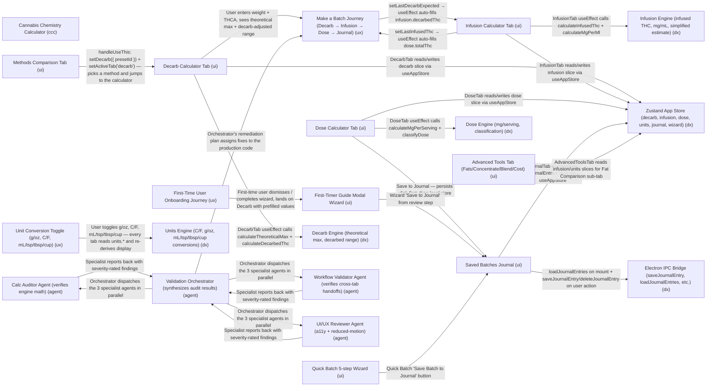

# Experience Topology Report: Cannabis Chemistry Calculator (ccc)

Overall status: **WARN**

## Coverage Summary

- Nodes: 21
- Edges: 25
- UI: 8
- UX: 3
- DX: 6
- AGENT: 4

## Topology Map

## Verification Results

| Check | Status | Detail |
|---|---|---|
| Layer Presence | PASS | All layers present. |
| Edge Reference Integrity | PASS | All edges reference known nodes. |
| Node Connectivity | PASS | No isolated nodes. |
| Data Contract Completeness | PASS | All edges define data contracts. |
| Node Evidence Completeness | PASS | All nodes include evidence. |
| Node Evidence Typing | PASS | All nodes use evidence_type in {test, telemetry, artifact}. |
| Critical Node Executable Evidence | PASS | All critical nodes use executable evidence_type. |
| High Risk Handoffs | WARN | High risk edges: dose-tab->journal-tab, first-timer-guide->journal-tab, quickbatch-tab->journal-tab, journal-tab->electron-ipc |
| High-Risk Critical Human Override | PASS | All critical/high-risk edges define human_override=true. |
| Critical Edge Failure Ownership | PASS | All critical-impact edges define fallback_path and owner_on_failure. |
| AI Handoff Contract Completeness | PASS | All declared AI handoffs include planner_output_contract, execution_guard_result, and verification_result. |
| Critical Edge Resilience Controls | PASS | All critical-impact edges define retry_policy, rollback_strategy, and degraded_mode. |

## Risk Register

- WARN: High Risk Handoffs -> High risk edges: dose-tab->journal-tab, first-timer-guide->journal-tab, quickbatch-tab->journal-tab, journal-tab->electron-ipc

## Suggested Actions

- Track follow-up for `High Risk Handoffs` before production.